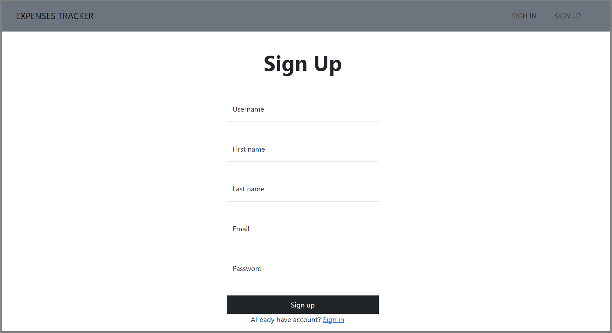

## Demo ứng dụng

  
  
  
  
  
  

## 🧱 **Kiến trúc tầng của hệ thống: Expense Tracker + CloudSQL + ArgoCD + Cloudflare + Kubernetes**

---

## ✅ Tóm tắt tầng:

| Tầng           | Công nghệ          | Vai trò chính                        |
| -------------- | ------------------ | ------------------------------------ |
| Client         | Browser + Domain   | Giao diện người dùng                 |
| CDN/SSL        | Cloudflare         | HTTPS, SSL Termination, Caching, WAF |
| Load Balancer  | GKE LoadBalancer   | Phân phối traffic đến pod            |
| Service Layer  | Kubernetes Service | Định tuyến nội bộ                    |
| App Layer      | Java Spring Boot   | API backend                          |
| DB Proxy Layer | Cloud SQL Proxy    | Cầu nối tới Cloud SQL                |
| Database       | Google Cloud SQL   | MySQL lưu trữ dữ liệu                |
| CI/CD Layer    | ArgoCD + Git       | GitOps tự động hoá triển khai        |

---

## 🧭 **Sơ đồ kiến trúc tổng thể ứng dụng**

---

## 🧱 **Bảng các chức năng**

| Tầng                 | Thành phần      | Công nghệ                        | Vai trò                       |
| -------------------- | --------------- | -------------------------------- | ----------------------------- |
| **1. Giao diện**     | Người dùng      | Trình duyệt + Cloudflare + HTTPS | Truy cập qua domain bảo mật   |
| **2. CDN + SSL**     | Cloudflare      | DNS + HTTPS + SSL Termination    | Đảm bảo bảo mật & hiệu suất   |
| **3. Load Balancer** | GKE Service     | LoadBalancer Service             | Phân phối traffic đến pod     |
| **4. Ứng dụng**      | Pod             | Java Spring Boot                 | Backend API server            |
|                      | Container phụ   | cloudsql-proxy                   | Kết nối Cloud SQL an toàn     |
| **5. Cơ sở dữ liệu** | Cloud SQL       | MySQL                            | Lưu dữ liệu                   |
| **6. Bảo mật**       | IAM + Secret    | Service Account JSON             | Ủy quyền truy cập DB          |
| **7. CI/CD**         | ArgoCD          | GitOps                           | Tự động hoá triển khai từ Git |
| **8. Git repo**      | GitHub / GitLab | YAML / Helm                      | Lưu trữ cấu hình triển khai   |

---

## 🛡️ **Các điểm bảo mật quan trọng**

* Cloudflare bảo vệ domain khỏi DDoS.
* HTTPS được bật từ Cloudflare đến LB.
* Cloud SQL Proxy dùng Service Account để truy cập database.
* Secrets được lưu dưới dạng Kubernetes Secret.
* ArgoCD có thể gắn RBAC theo namespace / project.

